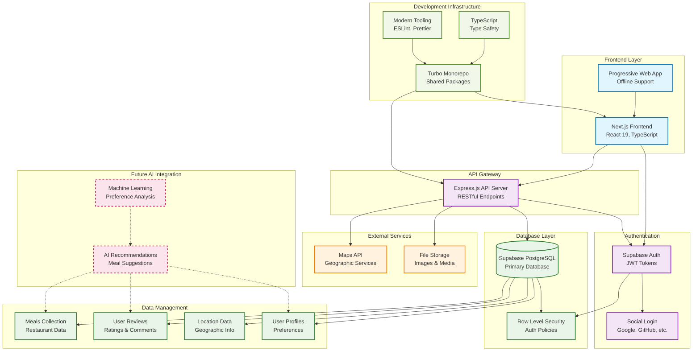

# Crowdsourced Meal Map - System Architecture

## System Design Diagram

## Architecture Overview

### Frontend Layer
- **Next.js Application**: React 19 with TypeScript for type safety
- **Progressive Web App**: Offline capabilities and mobile-first design

### Backend Services
- **Express.js API Gateway**: RESTful API endpoints for data management
- **Supabase Backend**: Authentication, database, and real-time features

### Data Management
- **PostgreSQL Database**: Structured data storage with Supabase
- **Row Level Security**: Fine-grained access control
- **Real-time Updates**: Live data synchronization

### Key Features
- **Crowdsourced Meal Discovery**: Community-driven restaurant and meal data
- **Location-based Search**: Geographic filtering and mapping
- **User Reviews & Ratings**: Community feedback system
- **Social Authentication**: Multiple login providers

### Development Infrastructure
- **Turbo Monorepo**: Efficient code sharing and build optimization
- **TypeScript**: End-to-end type safety
- **Modern Tooling**: ESLint, Prettier, and development best practices

## Usage Instructions

### For Miro:
1. Copy the mermaid code above
2. In Miro, add a "Code Block" or use a Mermaid integration
3. Paste the code to generate the diagram
4. Alternatively, use online tools like mermaid.live to generate an image, then import to Miro

### For Documentation:
This file can be used as reference documentation for the project architecture and shared with team members or stakeholders.
